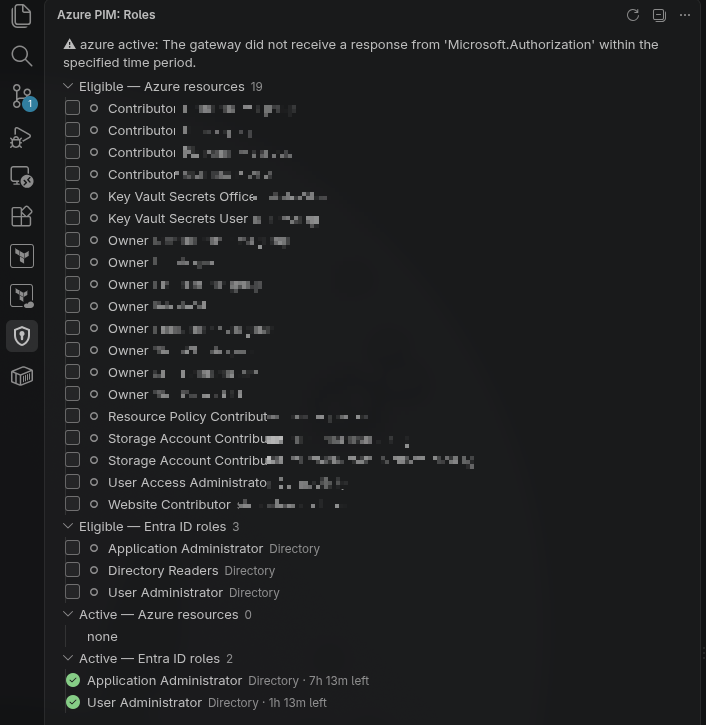

# Azure PIM for VS Code

Activate Azure PIM roles — both **Azure resource** roles and **Entra ID
(directory)** roles — from the sidebar. A port of the Neovim plugin in the
parent directory; same endpoints, same semantics, VS Code-native UI.



<sub>Scope names are blurred in the screenshot. The warning at the top is a
transient ARM gateway timeout being surfaced verbatim — it is why the Azure
activations count reads 0 there.</sub>

## Requirements

- VS Code 1.85+
- Azure CLI (`az`) on your `PATH`, logged in (`az login`)

Azure **resource** roles work off a plain `az login` and need nothing else.
There is no `curl` dependency — HTTP goes through Node's `fetch`.

## Using it

Open the shield icon in the Activity Bar, or run **Azure PIM: Show Roles**.

| Action | How |
| --- | --- |
| activate one role | the ▶ button on the row, or right-click → Activate Role |
| activate several | tick their checkboxes, then ▶ in the view title |
| deactivate | the ■ button on an active row |
| refresh | ⟳ in the view title |
| clear checkboxes | ⊘ in the view title |

Multi-select with <kbd>Ctrl</kbd>/<kbd>Shift</kbd> works too — Activate Role
applies to everything selected.

Activation asks for a justification and a duration (pre-filled with your
settings); the list refreshes a couple of seconds later, once Azure has
provisioned the assignment. Time-remaining labels tick over every minute
without hitting the API.

## Entra ID roles sign in separately

The Azure CLI cannot reach the Entra PIM endpoints at all, and this is not
something you can configure your way out of:

- a plain CLI token is refused by Graph with `PermissionScopeNotGranted`;
- asking for the scopes explicitly — `az login --scope
  https://graph.microsoft.com/RoleManagement.Read.Directory ...` — is rejected
  with `AADSTS65002`, because a Microsoft first-party app can only request
  scopes the API owner has preauthorized it for. Tenant admin consent does not
  override that.

So the Entra sections start collapsed behind a **Sign in to Microsoft Graph…**
row; nothing pops a browser until you click it. With `azpim.entraAuth` at its
default `auto` the extension then:

1. asks VS Code's built-in Microsoft account provider for the three PIM scopes;
2. if that account provider is refused them, falls back to its own device-code
   sign-in — it copies the code to your clipboard and opens the verification
   page.

Whichever wins is remembered, so this happens rarely. Device-code refresh
tokens live in VS Code's **SecretStorage** (your OS keychain), not on disk.
**Azure PIM: Forget Cached Entra ID Sign-in** clears both.

Set `azpim.showEntraRoles` to `false` to hide Entra roles and skip all of this.

### Preferably, use your own app registration

By default the device-code sign-in uses Microsoft Graph PowerShell's public
client, which is preauthorized for the whole delegated Graph surface. It works
with no setup, but the token it returns carries **every Graph scope your tenant
has ever consented for that app** — often `Directory.ReadWrite.All`,
`Sites.FullControl.All` and dozens more.

Registering a dedicated public client fixes that: the token then carries only
the three PIM scopes. All three are admin-consent-only, so a Global Admin (or
Privileged Role Administrator) runs this once:

```sh
cat > perms.json <<'JSON'
[{"resourceAppId":"00000003-0000-0000-c000-000000000000","resourceAccess":[
  {"id":"eb0788c2-6d4e-4658-8c9e-c0fb8053f03d","type":"Scope"},
  {"id":"8c026be3-8e26-4774-9372-8d5d6f21daff","type":"Scope"},
  {"id":"741c54c3-0c1e-44a1-818b-3f97ab4e8c83","type":"Scope"}]}]
JSON

APP=$(az ad app create --display-name "AzPim" \
  --is-fallback-public-client true \
  --required-resource-accesses @perms.json \
  --query appId -o tsv)
az ad sp create --id "$APP"
az ad app permission admin-consent --id "$APP"
echo "$APP"
```

Then set `azpim.graphClientId` to that app id and run **Azure PIM: Forget
Cached Entra ID Sign-in** once. The id is also passed to VS Code's account
provider (as its `VSCODE_CLIENT_ID` scope), so both paths use your registration.

| Scope | Permission id |
| --- | --- |
| `RoleEligibilitySchedule.Read.Directory` | `eb0788c2-6d4e-4658-8c9e-c0fb8053f03d` |
| `RoleAssignmentSchedule.ReadWrite.Directory` | `8c026be3-8e26-4774-9372-8d5d6f21daff` |
| `RoleManagement.Read.Directory` | `741c54c3-0c1e-44a1-818b-3f97ab4e8c83` |

## Settings

| Setting | Default | Meaning |
| --- | --- | --- |
| `azpim.duration` | `PT8H` | ISO 8601 activation length |
| `azpim.justification` | `Activated from VS Code` | default justification |
| `azpim.prompt` | `true` | `false` activates with the defaults, no prompts |
| `azpim.entraAuth` | `auto` | `auto` \| `vscode` \| `device` |
| `azpim.graphClientId` | — | public client for the Entra sign-in; see above |
| `azpim.graphTenantId` | — | tenant to sign in to; empty follows the CLI |
| `azpim.showEntraRoles` | `true` | list Entra ID roles at all |
| `azpim.azureCliPath` | `az` | path to the Azure CLI |

## Commands

| Command | Action |
| --- | --- |
| `Azure PIM: Show Roles` | reveal the view |
| `Azure PIM: Refresh` | reload from Azure |
| `Azure PIM: Activate Checked Roles` | activate everything ticked |
| `Azure PIM: Clear Checked Roles` | untick everything |
| `Azure PIM: Forget Cached Entra ID Sign-in` | drop the Graph token |

## Notes

- The **Active** sections list PIM *activations* only — permanent/standing role
  assignments are deliberately hidden, since there is nothing to activate or
  deactivate about them.
- `via group` marks an eligibility you hold through group membership rather than
  directly. Activation is still attempted as yourself; if your tenant requires
  activating the group membership instead, Azure's error is surfaced verbatim.
- Roles that require approval or MFA return the request in a `PendingApproval`
  state — the notification reports success, but the role only appears under
  Active once approved.
- Entra ID roles cannot be deactivated for the first **5 minutes** after
  activation; Graph rejects `selfDeactivate` with "The Active duration is too
  short". Wait it out, or let the activation expire.

## API used

ARM calls carry a token from `az account get-access-token`; Entra calls carry
the extension's own Graph token.

| What | Endpoint |
| --- | --- |
| Azure eligible | `GET /providers/Microsoft.Authorization/roleEligibilityScheduleInstances?$filter=asTarget()` |
| Azure active | `GET /providers/Microsoft.Authorization/roleAssignmentScheduleInstances?$filter=asTarget()` |
| Azure (de)activate | `PUT {scope}/providers/Microsoft.Authorization/roleAssignmentScheduleRequests/{guid}` |
| Entra eligible | `GET /roleManagement/directory/roleEligibilityScheduleInstances` |
| Entra active | `GET /roleManagement/directory/roleAssignmentScheduleInstances` |
| Entra (de)activate | `POST /roleManagement/directory/roleAssignmentScheduleRequests` |

## Developing

```sh
cd vscode
npm install
npm run compile      # or: npm run watch
```

Then <kbd>F5</kbd> in VS Code with this folder open ("Run Extension").

To install it into your own VS Code:

```sh
npx @vscode/vsce package     # produces azpim-0.1.0.vsix
code --install-extension azpim-0.1.0.vsix
```

## License

[MIT-0](../LICENSE) — MIT with the attribution requirement removed.

### Layout

| File | Role |
| --- | --- |
| `src/cli.ts` | the only place that shells out to `az` |
| `src/graph.ts` | Graph auth (VS Code provider / device code) and requests |
| `src/pim.ts` | the PIM endpoints themselves, ARM and Graph |
| `src/model.ts` | the `PimItem` row shape and its formatting |
| `src/tree.ts` | the sidebar `TreeDataProvider` |
| `src/extension.ts` | activation, commands, prompts, notifications |
